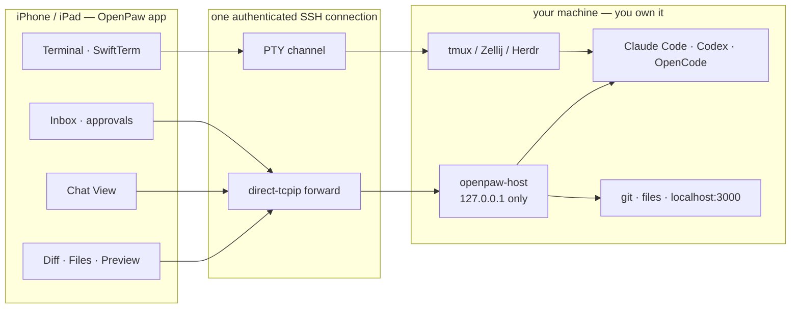

# OpenPaw

**Local-first, open-source mobile control plane for terminal-based AI coding agents.**

Your code, your repositories, your shell and your agent processes stay on your own Mac, Linux box, WSL install or
VPS. OpenPaw is the phone-shaped control surface in front of them: a real terminal, durable multiplexer sessions,
and a structured approval workflow for Claude Code, Codex and OpenCode.

OpenPaw is not another SSH client. It is four things that only make sense together:

1. **An open agent event protocol** — one normalized event stream for every coding agent.
2. **A secure mobile terminal** — SSH + PTY, hardware keyboard, CJK input, OSC 52/8, gestures.
3. **Durable remote sessions** — tmux / Zellij / screen / Herdr discovery, attach and restore.
4. **A native approval workflow** — risk-classified permission requests you can answer from your pocket, with
   local-first repository inspection (git diff, file browser, dev-server preview) to decide *with* context.

---

## Architecture



The terminal is the source of truth for **execution**. The agent's own transcript is the source of truth for
**conversation**. Chat View, the Inbox and the diff viewer are projections of those two — closing them never stops
an agent, a shell, a tmux session or a working directory.

`openpaw-host` binds to loopback only and is reached exclusively through SSH port forwarding. It has **no
remote-command endpoint**, on purpose: the app already owns an authenticated PTY channel, so a structured daemon
that could also run arbitrary commands would only widen the blast radius for nothing.

## Repository layout

| Path | What it is |
| --- | --- |
| `protocol/` | JSON Schema for the normalized event and inbox item, the capability spec, and golden fixtures captured from the real on-disk formats of Claude Code, Codex and OpenCode |
| `host/` | `openpaw-host`, a Rust workspace: protocol types, agent adapters, git, files, loopback preview proxy, daemon |
| `packages/` | Reusable Swift packages: `OpenPawProtocol`, `OpenPawTerminalCore`, `OpenPawSSH`, `OpenPawUI` |
| `apps/ios/` | The SwiftUI application |
| `tools/` | Developer tooling, including the headless UI snapshot renderer |
| `docs/` | Architecture, threat model, protocol reference, adapter compatibility matrix |

## Quick start

### 1. Run the host daemon on the machine that has your code

```sh
cd host
cargo build --release
./target/release/openpaw-host init --repo ~/src/your-project
./target/release/openpaw-host serve            # binds 127.0.0.1:8787
```

Install the agent hooks so approvals reach your phone instead of only your terminal:

```sh
./target/release/openpaw-host install-hooks --agent claude-code
```

### 2. Pair your phone

```sh
./target/release/openpaw-host pairing-code
# ABCD-EFGH-IJKL-MNOP-QRST-UVWX   (valid 5 minutes)

# Or show a local Quick Connect QR and copyable link.
./target/release/openpaw-host pair --name "Daniel's iPhone" --qr
```

Add the host in the app, then paste the code or scan the QR. Quick Connect links
contain only local SSH target metadata, optional host-key fingerprints, and the
same five-minute single-use pairing code. They never include passwords, private
keys, hook tokens, bearer tokens, HMAC keys, or commands. The app still asks you
to confirm the SSH credential. It forwards `127.0.0.1:8787` over its own SSH
connection; nothing is published to a network interface, and no cloud service is
involved.

### 3. Build the app

```sh
cd apps/ios
xcodebuild -project OpenPaw.xcodeproj -scheme OpenPaw -destination 'generic/platform=iOS Simulator' build
```

If `xcodebuild` refuses to load its plug-ins, that machine's Xcode first-launch content is stale — run
`sudo xcodebuild -runFirstLaunch`. Without a working Xcode you can still type-check the app against the iOS
simulator SDK with `apps/ios/scripts/typecheck-ios.sh`.

### Verify everything

```sh
bash scripts/check.sh
```

Formatting, lints, 268 Rust tests, 375 Swift tests, the app build, 140 headless UI snapshots, and
`scripts/smoke.py` driving the built daemon end to end — pairing, request signing, replay rejection, the approval
gate, git routes, the preview proxy, uploads, and the absence of a remote-command endpoint.

Picking this up on a different machine, or wondering what has never been verified anywhere?
[`docs/handoff.md`](docs/handoff.md).

## Security model

The short version — the long version is [`docs/threat-model/README.md`](docs/threat-model/README.md).

- Private keys live in the Keychain with `kSecAttrAccessibleWhenUnlockedThisDeviceOnly`, are non-exportable by
  default, and exporting one requires a fresh biometric check.
- Host keys are pinned on first use. A **changed** host key is a hard block, never a warning you can swipe away.
- The daemon binds loopback, pairs per device, stores only a SHA-256 of each bearer token, signs every request
  with HMAC-SHA256 over a canonical string, and rejects stale timestamps and replayed nonces.
- Capabilities are per device (`observer` cannot approve anything). Repository roots and preview ports are
  allowlists. Every path is canonicalized; symlinks that escape a root are listed but never read through.
- Approvals are risk-classified into eight buckets. Anything touching `rm`, `sudo`, credentials, `git push
  --force`, a production deploy or a database mutation cannot be approved until the full command has been
  expanded on screen — there is no blanket green button.
- A push notification is a *hint*, never a trust root. Decisions are authorized by a one-time action token
  delivered over the authenticated tunnel, single-use, with a ten-minute TTL and an audit-log entry.

## Supported agents

| Agent | Structured events | Approvals | Source |
| --- | --- | --- | --- |
| Claude Code | yes | yes (hooks) | `~/.claude/projects/*/*.jsonl` + `PreToolUse`/`Notification`/`Stop` hooks |
| Codex | yes | read-only today | `~/.codex/sessions/**/rollout-*.jsonl` |
| OpenCode | yes | read-only today | `~/.local/share/opencode/storage/{session,message,part}` |
| Anything else | terminal only | terminal only | `GenericAdapter` (OSC 9/777 and OSC `1337;OpenPaw=` markers) |

Adapters are versioned and pinned by golden fixtures, because these formats move. See
[`docs/agent-adapters/README.md`](docs/agent-adapters/README.md).

## Roadmap

Implemented today: the protocol, the host daemon, the Swift packages, and the app's terminal, session, inbox,
chat, diff, file-browser and preview surfaces.

Next, in order: evaluate native Mosh feasibility and licensing before any implementation; integrate Eternal Terminal
only after its disabled-by-default foundation is connected to the app and validated against real `etserver` and
physical devices; add on-device Whisper/Parakeet dictation models next to the shipped Apple Speech engine; add Live
Activities, Dynamic Island, Apple Watch approvals and an end-to-end encrypted push relay; and build an Android client
on the same protocol. Details in
[`docs/architecture/roadmap.md`](docs/architecture/roadmap.md).

## Contributing

See [`CONTRIBUTING.md`](CONTRIBUTING.md). New agent adapters need a fixture and a golden test; new host routes
need a capability and an audit entry. Both rules are enforced by review, not by convention.

## License

Apache-2.0 for code (`LICENSE`), CC BY 4.0 for the prose in `docs/`. The OpenPaw name and logo are not covered by
those grants, so that nobody can pass off a modified build as an official one.

---

OpenPaw is an independent open-source project. It is not affiliated with, endorsed by, or derived from any
commercial mobile agent client. All trademarks belong to their respective owners. Nothing here was obtained by
decompiling, reverse-engineering a paid product, or accessing a private API: the agent formats it reads are the
ones those agents write into your own home directory, and you can read them yourself with `cat`.
