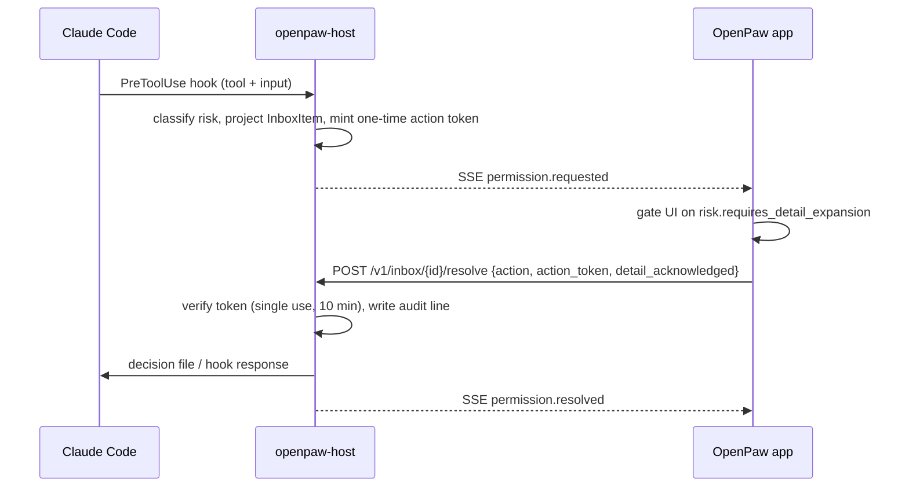

# Architecture

## The one-sentence version

The remote host keeps running everything; OpenPaw adds a *structured* channel next to the PTY so a phone can
understand what an agent is doing and answer it safely.

## Layers

```
apps/ios/OpenPawApp          SwiftUI shell, SwiftTerm surface, dictation, image capture
  packages/swift-openpaw-ui  every screen, platform-agnostic, snapshot-rendered in CI
  packages/swift-ssh-transport  SSHTransport, PortForwarder, KeychainStore
  packages/swift-terminal-core  RemoteTransport seam, multiplexers, scrollback, keymaps, host store
  packages/swift-agent-protocol OpenPawProtocol: events, risk, inbox, HostClient (REST + SSE)
                       |
             one SSH connection
                       |
host/crates/openpaw-host      axum on 127.0.0.1: auth, capabilities, SSE bus, audit
  openpaw-agents              adapters: claude-code, codex, opencode, generic
  openpaw-git                 status, diff, tree, blob, log — read-only, allowlisted
  openpaw-files               the filesystem security boundary
  openpaw-preview             loopback reverse proxy for dev servers
  openpaw-protocol            the normalized event, risk classifier, inbox projection, request signing
```

Nothing above depends on anything below it except through those seams. `openpaw-protocol` and
`OpenPawProtocol` are deliberate duplicates: one wire format, two independent implementations, both pinned to the
same golden files, so a drift in either is a test failure rather than a field bug.

## Why two sources of truth, and which one wins

| Question | Authority |
| --- | --- |
| What is actually executing right now? | the PTY / terminal |
| What was said in the conversation? | the agent's own transcript |
| What does the phone display? | a projection of the two |

This is why Chat View never reconstructs a conversation by scraping ANSI output. Screen-scraping a TUI is fragile
in exactly the cases that matter — a redrawn spinner, a resized window, a `clear`. The adapters read the agent's
structured logs instead, and the terminal remains available and authoritative for execution.

Corollary: closing Chat View, the Inbox or the whole app stops nothing. The agent, the shell, the multiplexer
session and the working directory are all owned by the host.

## Durable sessions

Mosh solves *network* mobility: your UDP session survives a Wi-Fi-to-cellular handoff. It does not solve *process*
lifetime — when the remote shell exits, it is gone. tmux (or Zellij, screen, Herdr) solves process lifetime. Use
both:

```
app  --SSH/Mosh/ET-->  host  --attach-->  tmux  --runs-->  agent
```

`TransportSelector` implements the `auto` policy: try Mosh, then Eternal Terminal, then SSH, biased by whatever
last worked for that host, and always able to explain in one sentence why it fell back. Only the SSH transport is
implemented today; the seam (`RemoteTransport`) exists so the other two are additions, not rewrites.

## Event flow for an approval



The push notification, when one exists, carries an opaque session id and a one-line preview and nothing else. The
command text, the diff and the transcript are fetched over the tunnel. A notification is never a capability.

## Extending the terminal beyond SSH

`TerminalScreen` renders bytes; it has no idea what produced them. That is what makes a local shell, `kubectl
exec`, `docker exec`, a serial console or a WebSocket PTY additions rather than forks. The only requirement is a
`RemoteTransport`.
