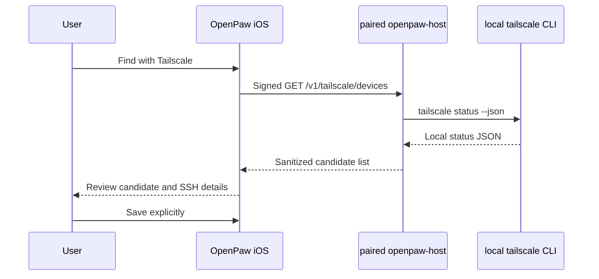

# OpenPaw Tailscale Discovery Design and Implementation Plan

> **Status:** Approved for implementation from the existing OpenPaw product direction. The user asked for a real, modern Tailscale SSH Home without embedding credentials or making false trust claims.

**Goal:** Let a connected OpenPaw host report sanitized Tailscale peers to the iOS onboarding flow so a user can select a candidate, review SSH details, and save it explicitly. Discovery must remain read-only, capability-gated, and separate from trust, credentials, and connection.

**Tech stack:** Rust/Axum host daemon, existing HMAC-authenticated host API, Swift 6 protocol client and backend, SwiftUI onboarding, Swift Testing/XCTest, canonical host and snapshot checks.

## Product decision

Three approaches were evaluated:

1. **Host-local discovery through `tailscale status --json`**. The paired `openpaw-host` daemon runs one fixed read-only command, parses the result, and returns a narrow candidate model. This requires no Tailscale admin credential in the iOS app and works with the trust boundary OpenPaw already has.
2. **Direct Tailscale API access from iOS**. A user could provide an OAuth client with `devices:core:read`, but its long-lived client secret would have to live on the phone and setup requires tailnet administration. This is secure only as an advanced administrator feature and is not the friendly default.
3. **Tailscale OAuth apps**. Official Tailscale documentation marks OAuth apps as alpha and restricts an app and its users to the same tailnet. That is not a general public OpenPaw onboarding path.

OpenPaw will implement approach 1. A direct API connector is deferred. OpenPaw does not claim a native Tailscale SDK or VPN implementation.

## First-run boundary

Automatic discovery cannot work before the user has at least one OpenPaw host that is manually configured, SSH-connected, paired with `openpaw-host`, and logged into Tailscale. The zero-host experience therefore keeps **Manual SSH** as a first-class route. After one host is connected, **Find with Tailscale** can discover other tailnet candidates from that host.

This limitation must be visible in the UI. “No connected discovery host” is not “no Tailscale devices.” Candidates are never auto-saved, trusted, or dialed.

## Architecture and data flow

1. The host adds `GET /v1/tailscale/devices`, protected by the existing request-signing middleware and a new read-only `devices.read` capability.
2. The route invokes only a fixed argv equivalent to `tailscale status --json`. No query parameter or request body can become a shell command.
3. A dedicated parser converts the untrusted JSON into a sanitized candidate record containing only stable ID, display name, DNS name, Tailscale IPs, operating system, online state, and last-seen time when present.
4. The host returns a versioned response. Raw status JSON, users, routes, keys, and credentials never leave the host.
5. `HostClient`, `OpenPawBackend`, and `HostAPIBackend` expose a read-only discovery method.
6. `OpenPawModel` owns loading, success, unavailable, empty, and failure state. Add Device consumes model state rather than fixtures.
7. Selecting a candidate prefills `HostEditorView`. The user still chooses username, authentication reference, transport preference, and whether to save. The candidate remains explicitly untrusted until that confirmation.



## Security and failure handling

- Add `devices.read` as read-only and include it in observer/operator profiles only after route tests prove enforcement.
- The route is unavailable without a valid HMAC signature, a paired device, and the capability.
- Use process argv, not `sh -c`. Enforce timeout and output-size limits.
- Treat missing `tailscale`, logged-out state, unsupported JSON, timeout, and malformed output as distinct typed failures.
- Never label a candidate “trusted,” “verified,” or “SSH ready.” Online status is Tailscale reachability metadata, not proof that SSH or OpenPaw is available.
- Do not include raw stderr or secrets in user-facing errors. Keep diagnostics actionable, such as “Tailscale is not installed on the connected host.”
- Repeated refresh is user initiated or conservatively rate limited. Home must not poll while locked or without a connected host.

## TDD implementation tasks

### Task 1: Host candidate model and parser

**Files:**
- Create: `host/crates/openpaw-host/src/api/tailscale.rs`
- Modify: `host/crates/openpaw-host/src/api/mod.rs`
- Test: host API module tests or a dedicated Tailscale parser test module

Write failing tests for peer maps and arrays, IPv4/IPv6 normalization, optional DNS names, online/offline state, missing CLI, logged-out output, malformed JSON, timeout, and output limits. Implement a fixed-command runner seam and sanitized response model.

### Task 2: Capability-gated route

**Files:**
- Modify: `protocol/capability-spec/capabilities.json`
- Modify: `host/crates/openpaw-host/src/auth.rs` if capability enumeration is explicit
- Modify: `host/crates/openpaw-host/src/api/mod.rs`
- Modify: `docs/protocol/host-api.md`

Add RED tests proving unsigned, unpaired, and capability-missing requests are rejected, while an authorized read-only request succeeds. Verify no command input reaches the runner.

### Task 3: Swift protocol and backend

**Files:**
- Modify: `packages/swift-agent-protocol/Sources/OpenPawProtocol/HostClient.swift`
- Modify: `packages/swift-agent-protocol/Tests/OpenPawProtocolTests/HostClientTests.swift`
- Modify: `packages/swift-openpaw-ui/Sources/OpenPawUI/Backend/OpenPawBackend.swift`
- Modify: `packages/swift-openpaw-ui/Sources/OpenPawUI/Backend/PreviewBackend.swift`
- Modify: `apps/ios/OpenPawApp/HostAPIBackend.swift`

Add Codable/Sendable/Hashable protocol types and exact client response/error tests. Keep the method read-only and host-scoped.

### Task 4: Model and onboarding integration

**Files:**
- Modify: `packages/swift-openpaw-ui/Sources/OpenPawUI/Model/OpenPawModel.swift`
- Modify: `packages/swift-openpaw-ui/Sources/OpenPawUI/Screens/AddDeviceFlow.swift`
- Modify: `packages/swift-openpaw-ui/Sources/OpenPawUI/Screens/HostEditorView.swift`
- Test: `packages/swift-openpaw-ui/Tests/OpenPawUITests/ShellTests.swift`

Test loading, success, empty, unavailable, retry, cancellation, and stale-response suppression. Test that candidates are never saved or selected automatically, and that manual SSH remains available through every failure state. Candidate confirmation must prefill only non-secret host identity fields.

### Task 5: Acceptance

Run:

```bash
cargo test --workspace --manifest-path host/Cargo.toml
swift test --package-path packages/swift-agent-protocol
swift test --package-path packages/swift-openpaw-ui
swift build --package-path tools/openpaw-snapshot -c release
bash scripts/check.sh
```

Render empty, loading, candidates, unavailable, and malformed-response onboarding states with zero failed or blank snapshots. Then run the real acceptance path against a paired local host with Tailscale installed. Record the observed candidate count and confirm that opening a candidate does not save, trust, or connect until the user explicitly completes Host Editor.
