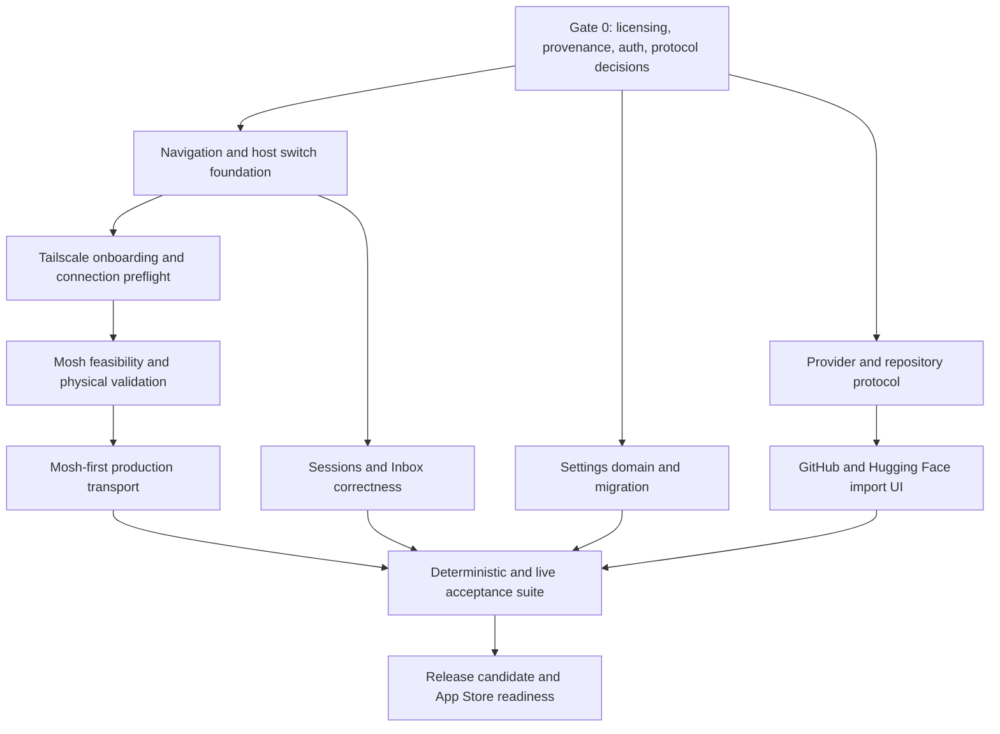

# OpenPaw Production Workspace Expansion Design

**Date:** 2026-08-23

**Status:** Proposed

**Scope:** Tailscale-assisted onboarding, resilient transports, root navigation, Terminal host switching, Sessions, Inbox, repository providers, Settings, and release verification.

## Product goal

OpenPaw should feel like a modern, local-first mobile control plane for remote development. A user should be able to discover or add a machine, connect through the best available transport, restore or create a session, handle agent work, inspect repositories, and tune the application without learning OpenPaw's internal architecture.

The production hierarchy remains:

```text
Device → Workspace → Session → Surface
```

- **Device** is a trusted SSH/OpenPaw host.
- **Workspace** is a repository or working root on that host.
- **Session** is a durable multiplexer-backed activity.
- **Surface** is Terminal, Session transcript, Inbox, Repo, Preview, or Settings.

The expansion must preserve three existing invariants:

1. The terminal is useful over plain SSH even when `openpaw-host` is unavailable.
2. Structured actions are typed, capability-gated, audited, and never become an arbitrary command endpoint.
3. Credentials and provider tokens are never exposed through the host API, logs, exports, or UI fixtures.

## Platform truths and non-negotiable gates

### The installed Tailscale app cannot expose its account to OpenPaw

iOS sandboxing does not let OpenPaw read another application's logged-in account, peer list, or `tailscaled` LocalAPI. Opening Tailscale on the phone can make network routes available, but it cannot automatically hand OpenPaw the user's account or devices.

Therefore “automatic Tailscale onboarding” means:

1. OpenPaw detects that a likely Tailscale route is available and explains that this is only a connectivity hint.
2. If any paired OpenPaw host is reachable, OpenPaw automatically asks that host for `tailscale status --json` through the existing authenticated `devices.read` endpoint.
3. The user confirms a discovered device before OpenPaw stores or trusts it.
4. With no discovery host, OpenPaw offers direct MagicDNS/`100.64.0.0/10` entry and a typed connection preflight.
5. An optional advanced connector may use a user-owned Tailscale OAuth client. This is an administrator workflow, not normal Tailscale login, and must remain clearly labeled.

OpenPaw must never imply that a route hint proves account ownership, and must never silently save every tailnet device.

### Mosh is technically feasible but legally gated

Mosh provides the roaming behavior the user wants: SSH bootstrap, UDP transport, local echo, and resilience across Wi-Fi and cellular changes. Upstream Mosh is GPL-3.0-or-later, while OpenPaw is currently Apache-oriented. Shipping a linked or derived iOS client without a deliberate licensing decision would be irresponsible.

Gate M0 must explicitly decide distribution channel and obligations, including GPLv3 compatibility with App Store terms, static or dynamic linking treatment, complete corresponding source delivery, downstream relinking rights where applicable, acknowledgements, and whether Mosh-enabled builds must be distributed outside the App Store. It must choose one of:

1. Distribute the combined application under GPL-compatible terms.
2. Obtain a suitable license exception.
3. Implement a clean-room compatible protocol client after legal review.

No Mosh client implementation or linked feasibility build begins before Gate M0 approves a lawful path. Documentation and UI may describe Mosh as planned, but production branding must not claim it until Gate M0 and physical-device acceptance pass.

### Eternal Terminal is independently gated

Upstream Eternal Terminal is GPL-3.0. OpenPaw currently contains only an isolated, disabled Swift protocol foundation, and its provenance includes studying pinned upstream wire behavior. Gate E0 must independently review copyright/protocol provenance, clean-room sufficiency, GPLv3 and App Store implications, attribution/source obligations, and distribution channel before any complete ET transport is linked into the app. It must also require real `etserver` interoperability, reconnect correctness, dependency concurrency review, and physical-device lifecycle acceptance. Until E0 passes, ET remains protocol-only, disabled, and absent from selectable transport UI.

### GitHub and Hugging Face imports keep provider tokens on the host

The phone is the control surface, but the selected host is the system that must clone and refresh a checkout. The safest production design is a host-scoped provider connection, not a duplicated phone credential.

- The phone asks the selected host to begin provider device authorization, then opens the returned verification URL and displays the returned user code.
- GitHub uses a GitHub App device flow with least-privilege repository permissions.
- Hugging Face uses its public OAuth device flow with the minimum repository scopes.
- The host polls the provider, stores the resulting token in a mode-0600 provider store, and never returns it through the API.
- Public repository imports need no provider credential.
- The phone sees provider identity, sanitized repository metadata, authorization status, import progress, and typed failures only.
- A future phone-global provider account may be added for cross-host browsing, but it is not needed for this release and must not become the source of host clone credentials.

## Alternatives considered

### Tailscale discovery

| Approach | Benefit | Cost/risk | Decision |
|---|---|---|---|
| Read installed iOS Tailscale account | Ideal UX | Not available to a sandboxed third-party app | Reject as impossible |
| Paired-host `tailscale status --json` | Least privilege, already implemented, no admin secret on phone | Requires one reachable host | Default |
| Tailscale OAuth client and Devices API | Zero-host enumeration | Admin-created secret, one-tailnet operational burden | Advanced optional connector |
| Manual MagicDNS/IP | Always available | User enters one address | Required fallback |

### Root tab switching

| Approach | Benefit | Cost/risk | Decision |
|---|---|---|---|
| Native paged `TabView` around every surface | Natural paging | Recreates heavy Terminal/WebView surfaces, conflicts with navigation stacks | Reject |
| Full-screen unconditional `DragGesture` | Simple | Steals terminal selection, horizontal scrolling, Inbox actions, and back swipe | Reject |
| Central destination swipe recognizer with arbitration | Meets the requested gesture while preserving controls | More policy and tests | Adopt |
| Control-deck-only swipe | Safest | Does not meet the requested whole-app behavior | Keep as fallback/accessibility path |

The adopted recognizer changes root destinations only after a high-confidence horizontal fling. It does not wrap. It ignores the system leading-edge back gesture, active text selection, horizontal diff/code scrolling, Inbox row actions, and modal/navigation transitions. The Terminal accepts the gesture only when the recognizer wins on velocity and dominance without cancelling touches. The control deck remains a second, explicit paging surface. A 44-point edge handle restores a stowed deck.

### Repository imports

| Approach | Benefit | Cost/risk | Decision |
|---|---|---|---|
| Remote shell `git clone` | Easy | Breaks no-exec invariant and quoting/security boundaries | Reject |
| Narrow typed clone API | Auditable and enforceable | Requires registry and hardened git runner | Adopt |
| Import only existing roots | Safest | Does not satisfy provider import | Preserve as an additional option |

## Proposed experience

### 1. Add Device becomes connection onboarding

The home action is renamed to **Add device**. It opens one flow with three entry paths:

1. **Tailscale devices**
   - Immediately shows “Tailscale route detected” when an `NWPathMonitor` hint is present.
   - Automatically refreshes from the best connected paired discovery host.
   - Shows which host supplied the list and when it was refreshed.
   - Candidate confirmation shows hostname, addresses, online state, and the exact SSH target that will be saved.
2. **SSH / transport preference**
   - Accepts a hostname, user, port, credential reference, jump hosts, and transport preference.
   - Shows Mosh or ET only when that transport is legally approved and compiled into the current build.
   - Runs a staged preflight: network reachability, host key, authentication, OpenPaw capability, multiplexer, and capability checks only for transports compiled into the build.
3. **Tailscale admin connector**
   - Advanced section only.
   - Explains that a tailnet administrator must create the OAuth client.
   - Requests read-only device scope.
   - Stores credentials in Keychain and supports revoke/delete.

Nothing is trusted or persisted until the confirmation screen succeeds. Host-key verification remains before credential presentation.

### 2. Transport selection is honest and resilient

The transport picker exposes only transports both legally approved and compiled into the build. After M0 and E0 pass, “Automatic” uses this policy order:

```text
Mosh → Eternal Terminal → SSH
```

Before those gates pass, unavailable transports are omitted, so today's production plan is SSH-only.

Unavailable transports are skipped with a human-readable reason. A failed attempt records diagnostics but does not mutate the host record. The last successful transport is persisted and tried first when it remains compatible with the user's preference.

Mosh bootstrap uses the already verified SSH channel. The application never executes a free-form probe assembled from user input. Capability probes use fixed commands or typed host capabilities. Session durability remains a multiplexer concern, so kill/relaunch restoration is tested separately from network roaming.

### 3. Root navigation supports deliberate horizontal switching

The root destination order is:

```text
Home ↔ Terminal ↔ Sessions ↔ Inbox ↔ Repo ↔ Settings
```

The existing destination named `chat` becomes `sessions`. Chat remains the detail surface of a selected session.

Interaction rules:

- Horizontal fling changes one destination.
- No circular wraparound.
- Leading-edge right swipe remains NavigationStack back.
- Inbox trailing row gestures remain local. Destructive Deny never allows full-swipe execution.
- Long press remains reserved for push-to-talk.
- VoiceOver gets adjustable actions, keyboard users get `⌘⌥←` and `⌘⌥→`, and all tabs remain directly tappable.
- The control deck keeps its existing horizontal page, vertical fold, and stow gestures.

### 4. Terminal owns a shared Host Switcher

Replace passive “No host” text with a tappable host chip in the Terminal header. The same component is used by regular-width sidebar chrome.

The menu contains:

- Current host and status.
- Saved hosts, status, and selected transport.
- **Connect**, **Disconnect**, or **Reconnect** as appropriate.
- **Add device…** and **Manage hosts…**.

Selecting a host updates `selectedHostID`, invalidates host-scoped requests through the existing generation mechanism, and then offers an explicit Connect action. We do not silently connect merely because a menu row was touched. When no hosts exist, tapping the chip opens Add Device directly.

### 5. Sessions becomes a first-class tab

Sessions must support:

- Grouped durable sessions by workspace and multiplexer.
- Create, attach, rename where supported, kill with confirmation, and restore.
- A restoration banner backed by a real persisted restoration plan.
- Correct routing to Terminal after attach and to transcript after selection.
- Host switch cleanup of stale routes and selected session IDs.
- A deterministic simulator fixture plus nightly live-host tests.

The app keeps the existing three-scope model:

```text
Global defaults → per-host SessionProfile → live session state
```

No persistent arbitrary per-session settings tier is added unless a concrete use case requires it.

### Session command boundary

Session creation, attachment, rename, and kill must remain available on a plain SSH host. They are modeled as typed `MultiplexerCommand` values and rendered by the selected multiplexer adapter into fixed command templates with strictly validated session/window names. They are sent through the user's interactive terminal channel, not exposed as free-form text through the structured host API. When a future `sessions.manage` host capability is available, the same typed intent may use an audited host mutation, but it must retain the plain-SSH fallback and must never accept arbitrary shell text from an HTTP client.

### 6. Inbox is actionable, durable, and deeply tested

Inbox categories include approvals, questions, plans, alerts, and completed/expired work. Required behavior:

- Badge count and filters reflect current host state.
- Gated high-risk items show full details before Approve becomes available.
- Deny does not require acknowledgement, but destructive full-swipe is disabled.
- Approve-once uses the host action token and cannot be replayed.
- Dismissal persists. It cannot be a local filter that resurrects on refresh.
- Notification and deep-link routing open the correct host and item.
- Recovery sheets explain stale, resolved, disconnected, and permission failures.

### 7. Repository providers extend, not weaken, the Repo tab

The Repo empty state offers:

1. **Add an existing host checkout**
2. **Import from GitHub**
3. **Import from Hugging Face**

A new host-side `WorkspaceRegistry` replaces immutable boot-only roots. A successful import is canonicalized, checked against the fixed repository parent, persisted atomically, then made visible without daemon restart.

The typed clone operation enforces:

- HTTPS protocol only.
- Fixed destination under `<state_dir>/repos/<sanitized-name>`.
- No local clone, external protocol, templates, hooks, fsmonitor, prompts, or caller-selected directory.
- Timeout and byte limits.
- Audit entry and progress events.
- `repos.manage` capability separate from read-only repository capabilities.
- Hugging Face large files skipped by default with `GIT_LFS_SKIP_SMUDGE=1`; large-model download requires an explicit later decision and quota UI.

### 8. Settings becomes categorized and searchable

Settings uses a navigation-based information architecture rather than one long scroll. iPhone shows a searchable category list. iPad uses a split view. Categories are:

1. **Appearance**: app appearance, terminal theme, font, icon, contrast.
2. **Terminal & Input**: font size, cursor keys, shortcut bar, shortcut editor, gestures.
3. **Voice & Language**: recognition engine, locale, model management, privacy.
4. **Connections**: hosts, Tailscale connector, transport policy, connection diagnostics.
5. **Sessions & Budgets**: multiplexer defaults, scrollback, event budget, preview port.
6. **Agents & Inbox**: notifications, risk presentation, approval behavior.
7. **Repositories & Providers**: GitHub/Hugging Face accounts, import policy, LFS limits.
8. **Security & Privacy**: Face ID, grace interval, credentials, redaction, local data.
9. **Data & Export**: validated export/import, reset, migration status.
10. **Diagnostics & Developer**: logs, capability report, transport explanation, debug-only tools.
11. **About & Legal**: versions, licenses, privacy, acknowledgements.

The settings domain moves out of `SettingsView.swift`. One owner controls biometric policy at runtime. Imports are versioned, validated, diffed before apply, and require explicit confirmation for security reductions. Invalid negative budgets, ports, scrollback, and other numeric values are rejected instead of clamped inconsistently or allowed to crash.

## Moshi comparison and prioritized parity

| Capability | OpenPaw today | Target |
|---|---|---|
| SSH terminal, CJK, hardware keyboard | Present | Preserve and regression-test |
| Native Mosh | Missing | Gate M0, then production transport |
| Eternal Terminal | Isolated codec/protocol foundation only | Gate E0, then complete interoperability and app transport |
| tmux/Zellij/screen/Herdr abstractions | Present/partial UI | Complete attach/jump/recovery workflows |
| Voice input | Present and physical-device tested | Preserve turn ownership and finalization |
| Image paste/annotation | Present | Add acceptance coverage |
| Shortcut panels and terminal gestures | Present | Expose settings and accessibility |
| Themes/fonts/icons | Limited | Expand through Appearance settings |
| Face ID/key protection | Present | Fix live ownership and grace UI |
| OSC52 and tappable links | Present | Preserve security prompts and tests |
| Recent directories | Missing | Add per-host recent workspace shortcuts |
| Session recovery after kill | Partial | Persist plan and live-host acceptance |
| Agent chat, approvals, diff, files, preview | Present | Improve discoverability and end-to-end coverage |
| Live Activities, Dynamic Island, Watch | Missing | Post-release track after push/deep-link foundation |
| GitHub/Hugging Face import | Missing | Add provider and safe host import architecture |
| Open protocol, risk gates, audit | OpenPaw strength | Never regress |

Release 1 prioritizes core connectivity, navigation, Sessions, Inbox, Repo imports, and Settings. Apple ecosystem surfaces are a follow-up release because they add push, background, privacy, and review complexity without unblocking the core workflow.

## Verification strategy

### Deterministic simulator fixtures

Add a DEBUG + simulator-only scenario backend selected by launch argument. Scenarios seed hosts, sessions, Inbox items, repositories, provider results, failures, and restoration state. Fixtures must call the same model APIs as production and must not introduce a shipping bypass.

### Live host integration

A disposable authenticated host verifies pairing, capability negotiation, Tailscale discovery, session create/attach/kill, Inbox resolution, repository import, audit, and reconnect behavior.

### Physical-device acceptance

A real iPhone verifies:

- Tailscale route hint and paired-host discovery.
- Host key and credential flows.
- Apple Speech dictation.
- Mosh Wi-Fi to cellular roaming, sleep/wake, background/foreground, blocked-UDP fallback, and force-kill multiplexer restoration after M0.
- Keychain and biometric policy.
- Provider OAuth callback and revocation.

### Cross-feature invariants

Every host change must invalidate or reload Terminal, Sessions, Inbox, Repo, Preview, provider/import state, and deep-link targets. Every imported setting must migrate and validate before UI ownership changes. Every sensitive action must be auditable. Every fallback must explain what failed and what was selected.

## Rollout and dependency order



Each vertical slice lands behind a feature flag where its external dependency is not yet production-ready. The implementation plan defines the exact tests, files, commands, and commits.

## Definition of done

This expansion is done only when:

- The UI never promises access to information iOS cannot provide.
- A reachable paired host automatically supplies Tailscale candidates, while zero-host onboarding remains usable.
- Mosh and Eternal Terminal are either legally and technically approved and shipped, or visibly unavailable without false claims.
- Every root destination can be changed with a safe horizontal gesture and a direct control.
- Terminal always exposes host selection and connection actions.
- Sessions and Inbox pass deterministic XCUITests and live-host acceptance.
- GitHub and Hugging Face imports preserve host-only token storage and the no-exec invariant.
- Settings are categorized, migrated, validated, searchable, accessible, and fully persisted.
- Complete Swift, Rust, simulator iOS 26.5, snapshot, disposable-host, and physical-device matrices pass.
- Personal signing changes are excluded from commits.
